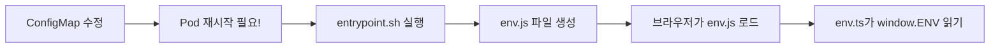

# 🔴 Crypto.subtle 에러 해결 가이드

## 문제 상황

```
message: 'Crypto.subtle is available only in secure contexts (HTTPS).'
```

### 증상
- localhost 포트포워딩: Keycloak 리다이렉트 **작동** ✅
- 마스터 노드 IP 포트포워딩: Keycloak 리다이렉트 **작동 안함** ❌

### 근본 원인

**`Crypto.subtle` API는 HTTPS 환경(secure context)에서만 사용 가능합니다.**

`react-oidc-context` 라이브러리가 내부적으로 다음 작업에 `Crypto.subtle`을 사용:
- PKCE (Proof Key for Code Exchange) - 이미 `pkce: false`로 비활성화됨
- State 파라미터 생성
- 기타 암호화 작업

### localhost에서 작동하는 이유

브라우저는 `localhost`와 `127.0.0.1`을 **"Potentially Trustworthy Origin"**으로 간주하여, HTTP여도 secure context로 취급합니다.

참고: [MDN - Secure Contexts](https://developer.mozilla.org/en-US/docs/Web/Security/Secure_Contexts)

### 외부 IP에서 작동하지 않는 이유

`http://192.168.x.x:포트` 같은 프라이빗 IP는 secure context가 아니므로 `Crypto.subtle` API 사용이 차단됩니다.

---

## ✅ 해결 방법

### 🌟 방법 1: HTTPS 사용 (권장)

포털을 HTTPS로 접근하도록 설정하는 것이 가장 올바른 해결책입니다.

#### 옵션 A: Ingress에 TLS 설정

```yaml
apiVersion: networking.k8s.io/v1
kind: Ingress
metadata:
  name: user-portal-ingress
  namespace: user-portal
  annotations:
    cert-manager.io/cluster-issuer: "letsencrypt-prod"  # 자동 인증서 발급
spec:
  ingressClassName: cilium
  tls:
  - hosts:
    - portal.customer.com
    secretName: portal-tls-secret
  rules:
  - host: portal.customer.com
    http:
      paths:
      - path: /
        pathType: Prefix
        backend:
          service:
            name: user-portal-frontend-service
            port:
              number: 80
```

#### 옵션 B: Nginx 리버스 프록시에 SSL 설정

고객사의 앞단 Nginx 리버스 프록시에 SSL 인증서 설정:

```nginx
server {
    listen 443 ssl;
    server_name portal.customer.com;
    
    ssl_certificate /etc/nginx/ssl/portal.crt;
    ssl_certificate_key /etc/nginx/ssl/portal.key;
    
    location / {
        proxy_pass http://k8s-node-ip:cilium-nodeport;
        proxy_set_header Host $host;
        proxy_set_header X-Forwarded-Proto $scheme;
    }
}
```

#### 옵션 C: 자체 서명 인증서 (개발/테스트용)

```bash
# 자체 서명 인증서 생성
openssl req -x509 -nodes -days 365 -newkey rsa:2048 \
  -keyout tls.key -out tls.crt \
  -subj "/CN=portal.customer.com"

# Kubernetes Secret 생성
kubectl create secret tls portal-tls-secret \
  --cert=tls.crt --key=tls.key \
  -n user-portal
```

---

### 🔧 방법 2: 코드 수정으로 HTTP 지원 (이미 적용됨)

**`portal-frontend/src/config/oidc.ts`에 다음 설정 추가:**

```typescript
import { WebStorageStateStore } from 'oidc-client-ts';

export const oidcConfig = {
  // ... 기존 설정 ...
  
  // PKCE 비활성화
  pkce: false,
  
  // HTTP 환경 지원: Crypto API를 사용하지 않는 StateStore 명시
  stateStore: new WebStorageStateStore({ store: window.sessionStorage }),
  userStore: new WebStorageStateStore({ store: window.sessionStorage }),
  
  // ... 나머지 설정 ...
};
```

**이 방법의 한계:**
- 보안이 약간 낮아짐 (PKCE 미사용)
- 일부 브라우저나 라이브러리 버전에서 완전히 작동하지 않을 수 있음
- 프로덕션 환경에서는 권장하지 않음

---

### 🚫 방법 3: 브라우저 플래그 (개발용만)

**Chrome/Edge:**
```bash
# Windows
chrome.exe --unsafely-treat-insecure-origin-as-secure="http://192.168.x.x:포트" --user-data-dir=/tmp/chrome-dev

# Mac
/Applications/Google\ Chrome.app/Contents/MacOS/Google\ Chrome \
  --unsafely-treat-insecure-origin-as-secure="http://192.168.x.x:포트" \
  --user-data-dir=/tmp/chrome-dev

# Linux
google-chrome --unsafely-treat-insecure-origin-as-secure="http://192.168.x.x:포트" \
  --user-data-dir=/tmp/chrome-dev
```

**경고:** 이 방법은 개발/테스트용으로만 사용하세요. 프로덕션에서는 사용 금지!

---

## 📝 ConfigMap 환경변수 관련 (질문 1 답변)

### env.ts vs env.js 혼동

```
소스코드 (빌드 시):
  portal-frontend/src/config/env.ts     ← TypeScript 소스코드

런타임 (컨테이너 내):
  /usr/share/nginx/html/env.js         ← entrypoint.sh가 생성
```

### ConfigMap 변경이 반영되는 과정



### ConfigMap 변경 방법

```bash
# 1. ConfigMap 수정
kubectl edit configmap frontend-env -n user-portal

# 또는 파일로 업데이트
kubectl apply -f deployment/frontend-configmap-customer.yaml

# 2. Pod 재시작 (필수!)
kubectl rollout restart deployment/user-portal-frontend -n user-portal

# 3. Pod가 Ready 상태가 될 때까지 대기
kubectl rollout status deployment/user-portal-frontend -n user-portal

# 4. 생성된 env.js 파일 확인
POD_NAME=$(kubectl get pod -n user-portal -l app=user-portal-frontend -o jsonpath='{.items[0].metadata.name}')
kubectl exec -n user-portal -it $POD_NAME -- cat /usr/share/nginx/html/env.js
```

### 확인 방법

브라우저 Console에서:
```javascript
// window.ENV 확인
console.log(window.ENV);

// 특정 값 확인
console.log(window.ENV.KEYCLOAK_URL);
console.log(window.ENV.PORTAL_URL);
```

---

## 🎯 권장 해결 순서

### 단기 (즉시 테스트 가능)

1. **코드 수정 적용** (이미 완료)
   ```bash
   # 프론트엔드 빌드 및 배포
   cd portal-frontend
   npm run build
   docker build -t <registry>/user-portal-frontend:<version> .
   docker push <registry>/user-portal-frontend:<version>
   
   # Kubernetes 배포
   kubectl set image deployment/user-portal-frontend \
     user-portal-frontend=<registry>/user-portal-frontend:<version> \
     -n user-portal
   ```

2. **테스트**
   - `http://마스터노드IP:포트`로 접근
   - 로그인 버튼 클릭
   - Keycloak 리다이렉트 확인

### 중기 (권장)

3. **HTTPS 설정**
   - 고객사 Nginx 리버스 프록시에 SSL 인증서 설정
   - 또는 Ingress에 TLS 설정
   - DNS 설정: `portal.customer.com` → 고객사 Nginx IP

4. **테스트**
   - `https://portal.customer.com`으로 접근
   - 모든 기능 확인

### 장기 (보안 강화)

5. **유효한 SSL 인증서 사용**
   - Let's Encrypt (무료)
   - 또는 고객사 CA 인증서
   - cert-manager를 통한 자동 갱신 설정

---

## 🔍 트러블슈팅

### Q1: 코드 수정 후에도 같은 에러가 발생합니다

**확인 사항:**
```bash
# 1. 새 이미지가 배포되었는지 확인
kubectl describe pod -n user-portal -l app=user-portal-frontend | grep Image:

# 2. entrypoint.sh 로그 확인
kubectl logs -n user-portal -l app=user-portal-frontend | head -30

# 3. 브라우저 캐시 완전 삭제 (Ctrl+Shift+Delete)
# 4. 시크릿 모드에서 테스트
```

### Q2: HTTPS 설정 후에도 Mixed Content 에러 발생

**원인:** Nginx 리버스 프록시가 `X-Forwarded-Proto` 헤더를 제대로 전달하지 않음

**해결:**
```nginx
# Nginx 리버스 프록시 설정
proxy_set_header X-Forwarded-Proto $scheme;
proxy_set_header X-Forwarded-For $proxy_add_x_forwarded_for;
```

### Q3: 자체 서명 인증서 사용 시 브라우저 경고

**해결:**
1. 브라우저에서 인증서 예외 추가
2. 또는 고객사 PC에 CA 인증서 설치
3. 또는 유효한 인증서 사용 (Let's Encrypt 등)

---

## 📊 보안 고려사항

### PKCE 비활성화의 영향

**PKCE (Proof Key for Code Exchange):**
- OAuth 2.0 보안 강화 메커니즘
- Authorization Code 탈취 공격 방지

**PKCE 비활성화 시:**
- 여전히 client_secret으로 보호됨
- 내부망에서는 큰 문제 없음
- 하지만 베스트 프랙티스는 PKCE 사용 (HTTPS 필요)

### 권장 사항

1. **개발/테스트:** HTTP + PKCE 비활성화 (임시)
2. **스테이징:** HTTPS + PKCE 활성화
3. **프로덕션:** HTTPS + PKCE 활성화 (필수)

---

## 🔗 참고 자료

- [MDN - Secure Contexts](https://developer.mozilla.org/en-US/docs/Web/Security/Secure_Contexts)
- [MDN - Crypto.subtle](https://developer.mozilla.org/en-US/docs/Web/API/Crypto/subtle)
- [OAuth 2.0 PKCE](https://datatracker.ietf.org/doc/html/rfc7636)
- [react-oidc-context Documentation](https://github.com/authts/react-oidc-context)
- [oidc-client-ts Documentation](https://github.com/authts/oidc-client-ts)

---

## ✅ 체크리스트

### 즉시 적용 (HTTP 환경)
- [x] `oidc.ts`에 `WebStorageStateStore` 설정 추가
- [ ] 프론트엔드 빌드
- [ ] Docker 이미지 빌드 및 푸시
- [ ] Kubernetes 배포
- [ ] HTTP로 접근하여 테스트

### 권장 적용 (HTTPS 환경)
- [ ] SSL 인증서 준비
- [ ] Nginx 리버스 프록시 또는 Ingress에 TLS 설정
- [ ] DNS 설정
- [ ] HTTPS로 접근하여 테스트
- [ ] `pkce: true`로 재설정 (선택사항)

### 확인 사항
- [ ] 브라우저 Console에 `Crypto.subtle` 에러 없음
- [ ] 로그인 버튼 클릭 시 Keycloak 리다이렉트 성공
- [ ] 로그인 후 대시보드 정상 표시
- [ ] 로그아웃 정상 작동

