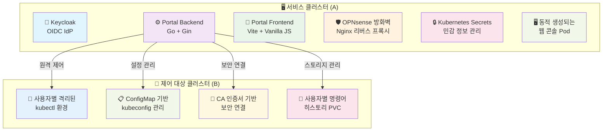
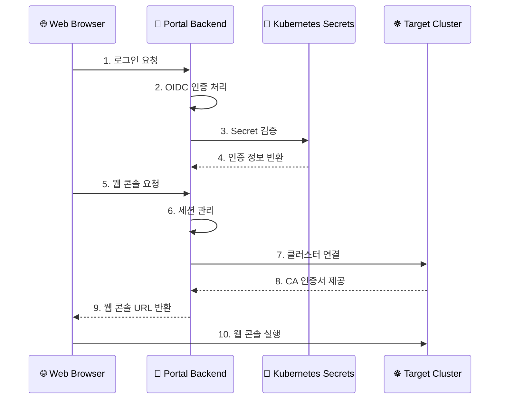

# Kubernetes 기반 개발자 및 데이터 분석가 사용자 포털

OIDC/LDAP 인증 기반의 통합 개발 및 분석 도구 포털입니다.

## 📋 프로젝트 개요

Kubernetes 기반 개발자 및 데이터 분석가를 위한 통합 웹 포털로, Keycloak/LDAP 인증을 통해 다양한 개발 및 분석 도구들에 SSO(Single Sign-On)로 접근할 수 있는 시스템입니다.

### 🎯 주요 기능

- **🔐 OIDC/LDAP 기반 통합 인증**: Keycloak을 통한 SSO 및 LDAP 그룹 기반 권한 관리
- **📊 통합 대시보드**: Grafana, Jenkins, ArgoCD, Secure Web Terminal 통합 접근
- **👥 프로젝트 기반 권한 관리**: LDAP 그룹 구조 `/dataops/{project}/{role}` 기반 다중 프로젝트 지원
- **🖥️ 동적 웹 콘솔**: 사용자별 격리된 Kubernetes 웹 터미널 환경
- **🎨 모던 React UI**: shadcn/ui 기반 반응형 대시보드
- **🔄 자동 로그아웃**: 웹 콘솔 리소스 정리 + Keycloak 세션 관리
- **📱 반응형 디자인**: 데스크톱 및 모바일 환경 지원

## 🏗️ 시스템 아키텍처

### 클러스터 구성



### 보안 아키텍처



### 사용자 흐름

1. **포털 접속**: `https://your-portal-domain.com` 접속
2. **SSO 로그인**: Keycloak을 통한 LDAP 계정 인증
3. **대시보드 표시**: 사용자 정보 및 프로젝트 권한 표시
4. **프로젝트 선택**: 다중 프로젝트 소속 시 드롭다운에서 선택
5. **도구 접근**: 
   - **Grafana**: 데이터 시각화 (자동 SSO)
   - **Jenkins**: CI/CD 파이프라인 (자동 SSO)
   - **ArgoCD**: GitOps 배포 (자동 SSO)
   - **Secure Web Terminal**: 격리된 Kubernetes CLI 환경
6. **웹 콘솔 실행**: 사용자별 동적 Pod 생성 및 새 탭에서 터미널 실행
7. **자동 로그아웃**: 웹 콘솔 리소스 정리 + Keycloak 세션 종료

## 🛠️ 기술 스택

### Backend
- **언어**: Go 1.24+
- **웹 프레임워크**: Gin
- **인증**: OIDC (coreos/go-oidc), JWT + Session 하이브리드
- **쿠버네티스**: client-go
- **보안**: JWT, Secret 기반 설정 관리, CSRF 보호
- **로깅**: 구조화된 로깅 (zap)
- **컨테이너**: Docker (크로스 플랫폼 빌드)

### Frontend
- **프레임워크**: React 18 + TypeScript
- **빌드 도구**: Vite
- **UI 라이브러리**: shadcn/ui + Radix UI
- **인증**: react-oidc-context
- **스타일**: Tailwind CSS
- **아이콘**: Lucide React
- **패키지 관리**: npm

### 인프라
- **인증**: Keycloak + OpenLDAP
- **컨테이너**: Docker
- **오케스트레이션**: Kubernetes
- **보안**: Kubernetes Secrets, CA 인증서
- **프록시**: Nginx (OPNsense 플러그인)
- **스토리지**: local-path StorageClass (명령어 히스토리용)

## 📁 프로젝트 구조

```
user-portal/
├── console-backend/          # 백엔드 애플리케이션 (Go)
│   ├── main.go              # 메인 애플리케이션 진입점
│   ├── internal/            # 내부 패키지
│   │   ├── config/          # 설정 관리
│   │   ├── auth/            # OIDC 인증 로직 + JWT 관리
│   │   ├── kubernetes/      # K8s 클라이언트 + 리소스 생성
│   │   ├── handlers/        # API 핸들러 (인증, 웹콘솔)
│   │   ├── middleware/      # 미들웨어 (로깅)
│   │   ├── models/          # 데이터 모델 (에러, 세션)
│   │   ├── logger/          # 구조화된 로깅
│   │   └── utils/           # 응답 유틸리티
│   ├── Dockerfile           # Docker 이미지 빌드
│   ├── env.example          # 환경 변수 예시
│   ├── CONFIG.md            # 설정 가이드
│   └── README.md            # 백엔드 상세 문서
├── portal-frontend/         # 프론트엔드 애플리케이션 (React)
│   ├── src/                 # 소스 코드
│   │   ├── components/      # React 컴포넌트
│   │   │   ├── ui/          # shadcn/ui 컴포넌트
│   │   │   ├── Dashboard.tsx     # 메인 대시보드
│   │   │   ├── AuthWrapper.tsx   # OIDC 인증 래퍼
│   │   │   ├── ProjectSelector.tsx # 프로젝트 선택기
│   │   │   └── UserInfo.tsx      # 사용자 정보 표시
│   │   ├── services/        # API 서비스
│   │   ├── types/           # TypeScript 타입 정의
│   │   ├── config/          # OIDC 설정
│   │   └── main.tsx         # React 진입점
│   ├── package.json         # npm 의존성 (React, TypeScript, shadcn/ui)
│   ├── tailwind.config.js   # Tailwind CSS 설정
│   ├── tsconfig.json        # TypeScript 설정
│   └── Dockerfile           # Docker 이미지 빌드
├── deployment/              # Kubernetes 배포 파일
│   ├── user-portal-backend.yaml     # 백엔드 배포
│   ├── user-portal-frontend.yaml    # 프론트엔드 배포
│   ├── user-portal-ingress.yaml     # Ingress 설정
│   ├── user-portal-secrets.yaml     # Secret 예시
│   ├── portal-backend-rbac.yaml     # 백엔드 RBAC
│   └── README.md            # 배포 가이드
├── web-terminal/            # 웹 터미널 컴포넌트
│   ├── Dockerfile           # 웹 터미널 이미지
│   ├── bashrc_template      # 개인화된 bashrc 템플릿
│   └── README.md            # 웹 터미널 가이드
└── README.md               # 프로젝트 전체 문서 (현재 파일)
```

## 🚀 빠른 시작

### 1. 사전 요구사항

- **Node.js** 18+ 및 npm
- **Go** 1.24+
- **Docker** (선택사항)
- **Kubernetes** 클러스터 접근 권한
- **Keycloak** 서버
- **local-path** StorageClass (명령어 히스토리용)

### 2. 프로젝트 클론

```bash
git clone https://github.com/your-org/user-portal.git
cd user-portal
```

### 3. 백엔드 설정

```bash
cd console-backend

# 의존성 설치
go mod download

# 환경 변수 설정
cp env.example .env
# .env 파일을 편집하여 실제 값으로 설정

# 애플리케이션 실행
go run main.go
```

### 4. 프론트엔드 설정

```bash
cd portal-frontend

# 의존성 설치
npm install

# 개발 서버 실행
npm run dev
```

### 5. Kubernetes 배포

```bash
# Secret 생성
kubectl apply -f deployment/user-portal-secrets.yaml

# 백엔드 배포
kubectl apply -f deployment/user-portal-backend.yaml
```

## 🔧 환경 변수 설정

### Backend 환경 변수

```bash
# OIDC 설정
OIDC_CLIENT_ID=frontend
OIDC_CLIENT_SECRET=your-client-secret
OIDC_ISSUER_URL=https://your-keycloak-domain.com/realms/your-realm
OIDC_REDIRECT_URL=https://your-portal-domain.com/callback

# 서버 설정
PORT=8080
GIN_MODE=release
ALLOWED_ORIGINS=https://your-portal-domain.com

# JWT 설정
JWT_SECRET_KEY=your-super-secure-jwt-secret

# Kubernetes 설정
KUBERNETES_CLIENT_ID=kubernetes
CONSOLE_NAMESPACE=user-portal

# 웹 콘솔 설정
CONSOLE_IMAGE=your-registry/web-terminal:latest
WEB_TERMINAL_DOMAIN=your-terminal-domain.com
```

### Frontend 환경 변수

```bash
# 개발 서버 포트 (기본값: 5173)
VITE_PORT=5173
```

## 📚 API 문서

### 인증 관련

| 엔드포인트 | 메서드 | 설명 |
|-----------|--------|------|
| `/api/login` | GET | OIDC 인증 시작 |
| `/api/callback` | GET | OAuth2 콜백 처리 |
| `/api/user` | GET | 사용자 정보 조회 |
| `/api/logout` | GET | 로그아웃 처리 |

### 웹 콘솔 관련

| 엔드포인트 | 메서드 | 설명 |
|-----------|--------|------|
| `/api/launch-console` | POST | 웹 콘솔 Pod 생성 및 실행 |
| `/api/console-status` | GET | 웹 콘솔 상태 확인 |
| `/api/logout-cleanup` | POST | 사용자 웹 콘솔 리소스 정리 |
| `/api/delete-user-resources` | POST | 사용자별 모든 리소스 삭제 |

## 🔐 보안 설정

### Secret 관리

민감한 정보는 Kubernetes Secret으로 관리됩니다:

```bash
# Secret 생성
kubectl create secret generic user-portal-secrets \
  --from-literal=jwt-secret-key="your-jwt-secret" \
  --from-literal=oidc-client-secret="your-oidc-secret" \
  --from-literal=kubectl-oidc-client-secret="your-kubectl-secret" \
  --from-literal=target-cluster-server="https://your-cluster:6443" \
  --from-literal=target-cluster-ca-cert-data="$(cat /path/to/ca.crt | base64 -w 0)" \
  -n user-portal
```

### CA 인증서 처리

타겟 클러스터의 CA 인증서를 base64로 인코딩하여 Secret에 저장:

```bash
# CA 인증서를 base64로 인코딩
cat /path/to/ca.crt | base64 -w 0
```

## 🆕 최신 개선사항 (v0.6.x)

### 🎨 모던 React UI 전면 개편
- **React + TypeScript**: Vanilla JS에서 React 18 + TypeScript로 전환
- **shadcn/ui 도입**: 모던하고 일관된 UI 컴포넌트 라이브러리
- **반응형 대시보드**: 데스크톱 및 모바일 최적화된 레이아웃
- **Tailwind CSS**: 유지보수성 높은 스타일링 시스템

### 👥 LDAP 기반 프로젝트 권한 관리
- **다중 프로젝트 지원**: `/dataops/{project}/{role}` 구조 기반
- **동적 프로젝트 선택**: 사용자가 소속된 프로젝트 자동 파싱 및 선택 UI
- **권한별 접근 제어**: `dev`(개발자), `adm`(관리자), `viewer`(조회자) 역할 구분
- **실시간 사용자 정보**: Keycloak 토큰에서 실제 사용자 정보 추출 및 표시

### 🔗 통합 서비스 포털
- **Grafana 연동**: 데이터 시각화 도구 SSO 접근
- **Jenkins 연동**: CI/CD 파이프라인 SSO 접근  
- **ArgoCD 연동**: GitOps 배포 도구 SSO 접근
- **통합 대시보드**: 모든 도구를 하나의 포털에서 관리

### 🔄 향상된 로그아웃 플로우
- **자동 리소스 정리**: 웹 콘솔 Pod/Service/Ingress/Secret 자동 삭제
- **Keycloak 세션 관리**: `id_token_hint` 사용으로 확인 페이지 없는 직접 로그아웃
- **상태 초기화**: 프론트엔드 상태 및 로컬 스토리지 완전 정리

### 🛡️ 보안 및 성능 강화
- **CSRF 보호**: State 기반 CSRF 공격 방지
- **세션 격리**: 사용자별 완전한 세션 격리
- **번들 최적화**: 모듈 수 감소 및 번들 크기 최적화
- **타입 안전성**: TypeScript 도입으로 런타임 에러 방지

## 🐳 Docker 배포

### 백엔드 배포

```bash
# 이미지 빌드
cd console-backend
docker buildx build --platform linux/amd64 -t your-registry/user-portal-backend:latest --push .

# 컨테이너 실행
docker run -p 8080:8080 --env-file .env your-registry/user-portal-backend:latest
```

### 프론트엔드 배포

```bash
# 이미지 빌드
cd portal-frontend
docker buildx build --platform linux/amd64 -t your-registry/user-portal-frontend:latest --push .

# 컨테이너 실행 (개발용)
docker run -p 3000:80 your-registry/user-portal-frontend:latest
```

### 웹 터미널 이미지

```bash
# 웹 터미널 이미지 빌드
cd web-terminal
docker buildx build --platform linux/amd64 -t your-registry/web-terminal:latest --push .
```

### 쿠버네티스 배포

```yaml
apiVersion: apps/v1
kind: Deployment
metadata:
  name: user-portal-backend
  namespace: user-portal
spec:
  replicas: 1
  selector:
    matchLabels:
      app: user-portal-backend
  template:
    metadata:
      labels:
        app: user-portal-backend
    spec:
      serviceAccountName: portal-backend-sa
      containers:
      - name: user-portal-backend
        image: your-registry/user-portal-backend:latest
        ports:
        - containerPort: 8080
        env:
        - name: OIDC_CLIENT_SECRET
          valueFrom:
            secretKeyRef:
              name: user-portal-secrets
              key: oidc-client-secret
        - name: JWT_SECRET_KEY
          valueFrom:
            secretKeyRef:
              name: user-portal-secrets
              key: jwt-secret-key
```

## 🧪 개발 및 테스트

### 로컬 개발

```bash
# 백엔드 개발 서버
cd console-backend
go run main.go

# 프론트엔드 개발 서버 (React + Vite)
cd portal-frontend
npm run dev
```

### 빌드 및 배포

```bash
# 프론트엔드 빌드
cd portal-frontend
npm run build

# Docker 이미지 빌드 (멀티 플랫폼)
docker buildx build --platform linux/amd64 -t your-registry/user-portal-frontend:0.6.7 --push .

# Kubernetes 배포
kubectl set image deployment/user-portal-frontend frontend=your-registry/user-portal-frontend:0.6.7 -n user-portal
```

## 📖 상세 문서

- **[Backend README](console-backend/README.md)** - 백엔드 상세 가이드
- **[Frontend README](portal-frontend/README.md)** - 프론트엔드 개발 가이드
- **[Deployment README](deployment/README.md)** - Kubernetes 배포 및 Secret 관리
- **[Configuration Guide](console-backend/CONFIG.md)** - 환경 변수 및 설정 가이드
- **[Web Terminal Guide](web-terminal/README.md)** - 웹 터미널 모듈 가이드

## 🤝 기여하기

1. Fork the Project
2. Create your Feature Branch (`git checkout -b feature/AmazingFeature`)
3. Commit your Changes (`git commit -m 'Add some AmazingFeature'`)
4. Push to the Branch (`git push origin feature/AmazingFeature`)
5. Open a Pull Request

## 📄 라이선스

이 프로젝트는 MIT 라이선스 하에 배포됩니다. 자세한 내용은 [LICENSE](LICENSE) 파일을 참조하세요.

## 📞 지원

프로젝트에 대한 질문이나 이슈가 있으시면 [Issues](https://github.com/garlicKim21/user-portal/issues)를 통해 문의해 주세요.

## 🙏 감사의 말

- [Gin](https://github.com/gin-gonic/gin) - Go 웹 프레임워크
- [Vite](https://vitejs.dev/) - 프론트엔드 빌드 도구
- [Keycloak](https://www.keycloak.org/) - OIDC 인증 서버
- [Kubernetes](https://kubernetes.io/) - 컨테이너 오케스트레이션

---

**Kubernetes 기반 개발자 및 데이터 분석가 사용자 포털** - OIDC/LDAP 기반 통합 개발/분석 도구 포털 