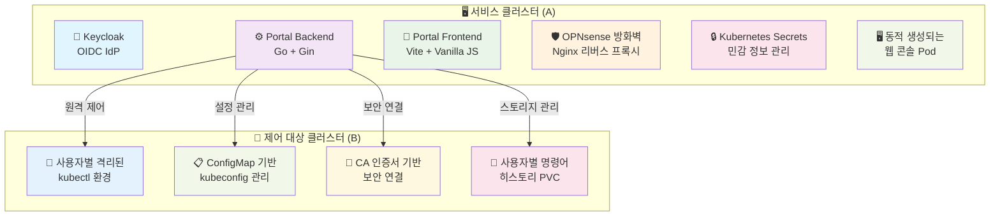
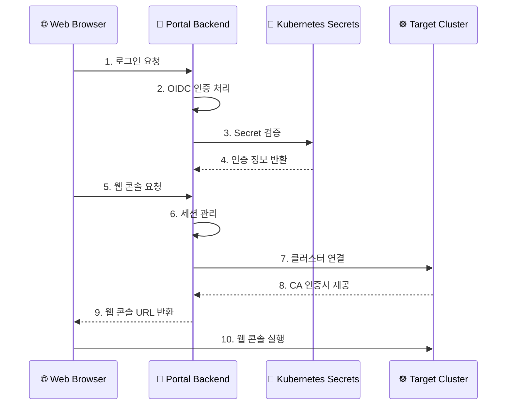

# User Portal - Kubernetes Web Console

OIDC와 동적 Pod를 이용한 쿠버네티스 웹 콘솔 포털 프로젝트입니다.

## 📋 프로젝트 개요

이 프로젝트는 사용자가 웹 포털을 통해 인증하고, 버튼 클릭 한 번으로 자신만의 격리된 웹 기반 쿠버네티스 CLI(kubectl) 환경을 동적으로 제공받는 시스템을 구축하는 것이 목표입니다.

### 🎯 주요 기능

- **OIDC 기반 인증**: Keycloak을 통한 안전한 사용자 인증
- **동적 웹 콘솔 생성**: 사용자별 격리된 웹 터미널 환경 제공
- **다중 클러스터 지원**: A 클러스터에서 B 클러스터 제어
- **Secret 기반 보안**: 민감한 정보를 Kubernetes Secret으로 관리
- **모던 UI**: Glassmorphism 디자인의 전문적인 웹 인터페이스
- **개인화된 터미널**: 사용자별 맞춤형 웹 터미널 정보 표시
- **명령어 히스토리 지속성**: 사용자별 명령어 히스토리 영구 보존

## 🏗️ 시스템 아키텍처

### 클러스터 구성



### 보안 아키텍처



### 사용자 흐름

1. 사용자가 웹 브라우저로 포털에 접속
2. "Login" 버튼 클릭 → Keycloak 로그인 페이지로 리디렉션
3. LDAP 계정으로 로그인
4. 인증 성공 후 포털로 돌아와 사용자 정보 표시
5. "Open Web Terminal" 버튼 클릭
6. 백엔드에서 Secret에서 CA 인증서와 클러스터 정보 조회
7. 새 브라우저 탭에서 웹 기반 터미널 열림
8. 별도 로그인 없이 kubectl 명령어 사용 가능
9. **개인화된 터미널 정보 표시** (사용자 ID, 네임스페이스, 권한)
10. **명령어 히스토리 자동 저장 및 복원**

## 🛠️ 기술 스택

### Backend
- **언어**: Go 1.24+
- **웹 프레임워크**: Gin
- **인증**: OIDC (coreos/go-oidc), JWT + Session 하이브리드
- **쿠버네티스**: client-go
- **보안**: JWT, Secret 기반 설정 관리, CSRF 보호
- **로깅**: 구조화된 로깅 (zap)
- **컨테이너**: Docker (크로스 플랫폼 빌드)

### Frontend
- **빌드 도구**: Vite
- **언어**: Vanilla JavaScript
- **스타일**: CSS3 (Glassmorphism)
- **패키지 관리**: npm

### 인프라
- **인증**: Keycloak + OpenLDAP
- **컨테이너**: Docker
- **오케스트레이션**: Kubernetes
- **보안**: Kubernetes Secrets, CA 인증서
- **프록시**: Nginx (OPNsense 플러그인)
- **스토리지**: local-path StorageClass (명령어 히스토리용)

## 📁 프로젝트 구조

```
user-portal/
├── portal-backend/           # 백엔드 애플리케이션
│   ├── main.go              # 메인 애플리케이션 진입점
│   ├── internal/            # 내부 패키지
│   │   ├── config/          # 설정 관리
│   │   ├── auth/            # OIDC 인증 로직 + JWT 관리
│   │   ├── kubernetes/      # K8s 클라이언트 + 리소스 생성
│   │   ├── handlers/        # API 핸들러
│   │   ├── middleware/      # 미들웨어
│   │   ├── models/          # 데이터 모델
│   │   ├── logger/          # 로깅
│   │   └── utils/           # 유틸리티
│   ├── Dockerfile           # Docker 이미지 빌드
│   ├── env.example          # 환경 변수 예시
│   ├── CONFIG.md            # 설정 가이드
│   ├── OIDC_SETUP.md        # OIDC 설정 가이드
│   └── README.md            # 백엔드 상세 문서
├── portal-frontend/         # 프론트엔드 애플리케이션
│   ├── src/                 # 소스 코드
│   │   └── main.js          # 메인 JavaScript
│   ├── index.html           # 메인 HTML
│   ├── package.json         # npm 의존성
│   └── Dockerfile           # Docker 이미지 빌드
├── deployment/              # 배포 관련 파일
│   ├── user-portal-backend.yaml    # 백엔드 배포
│   ├── user-portal-secrets.yaml    # Secret 예시
│   └── README.md            # 배포 가이드
├── web-terminal/            # 웹 터미널 컴포넌트
│   ├── Dockerfile           # 웹 터미널 이미지
│   ├── bashrc_template      # 개인화된 bashrc 템플릿
│   └── concept.md           # 개념 문서
└── README.md               # 프로젝트 전체 문서 (현재 파일)
```

## 🚀 빠른 시작

### 1. 사전 요구사항

- **Node.js** 18+ 및 npm
- **Go** 1.24+
- **Docker** (선택사항)
- **Kubernetes** 클러스터 접근 권한
- **Keycloak** 서버
- **local-path** StorageClass (명령어 히스토리용)

### 2. 프로젝트 클론

```bash
git clone git@github.com:garlicKim21/user-portal.git
cd user-portal
```

### 3. 백엔드 설정

```bash
cd portal-backend

# 의존성 설치
go mod download

# 환경 변수 설정
cp env.example .env
# .env 파일을 편집하여 실제 값으로 설정

# 애플리케이션 실행
go run main.go
```

### 4. 프론트엔드 설정

```bash
cd portal-frontend

# 의존성 설치
npm install

# 개발 서버 실행
npm run dev
```

### 5. Kubernetes 배포

```bash
# Secret 생성
kubectl apply -f deployment/user-portal-secrets.yaml

# 백엔드 배포
kubectl apply -f deployment/user-portal-backend.yaml
```

## 🔧 환경 변수 설정

### Backend 환경 변수

```bash
# OIDC 설정
OIDC_CLIENT_ID=portal-app
OIDC_CLIENT_SECRET=your-client-secret
OIDC_ISSUER_URL=https://keycloak.basphere.dev/realms/basphere
OIDC_REDIRECT_URL=https://portal.basphere.dev/api/callback

# 서버 설정
PORT=8080
GIN_MODE=release
ALLOWED_ORIGINS=https://portal.basphere.dev

# JWT 설정
JWT_SECRET_KEY=your-super-secure-jwt-secret

# Kubernetes 설정 (Secret에서 관리)
TARGET_CLUSTER_SERVER=https://<target-cluster-api-server>:6443
TARGET_CLUSTER_CA_CERT_DATA=LS0tLS1CRUdJTi...

# 웹 콘솔 설정
CONSOLE_IMAGE=projectgreenist/web-terminal:0.2.11
CONSOLE_NAMESPACE=web-console
```

### Frontend 환경 변수

```bash
# 개발 서버 포트 (기본값: 5173)
VITE_PORT=5173
```

## 📚 API 문서

### 인증 관련

| 엔드포인트 | 메서드 | 설명 |
|-----------|--------|------|
| `/api/login` | GET | OIDC 인증 시작 |
| `/api/callback` | GET | OAuth2 콜백 처리 |
| `/api/user` | GET | 사용자 정보 조회 |
| `/api/logout` | GET | 로그아웃 처리 |

### 웹 콘솔 관련

| 엔드포인트 | 메서드 | 설명 |
|-----------|--------|------|
| `/api/launch-console` | GET | 웹 콘솔 Pod 생성 및 실행 |
| `/api/console-status` | GET | 웹 콘솔 상태 확인 |

## 🔐 보안 설정

### Secret 관리

민감한 정보는 Kubernetes Secret으로 관리됩니다:

```bash
# Secret 생성
kubectl create secret generic user-portal-secrets \
  --from-literal=jwt-secret-key="your-jwt-secret" \
  --from-literal=oidc-client-secret="your-oidc-secret" \
  --from-literal=kubectl-oidc-client-secret="your-kubectl-secret" \
  --from-literal=target-cluster-server="https://your-cluster:6443" \
  --from-literal=target-cluster-ca-cert-data="$(cat /path/to/ca.crt | base64 -w 0)" \
  -n user-portal
```

### CA 인증서 처리

타겟 클러스터의 CA 인증서를 base64로 인코딩하여 Secret에 저장:

```bash
# CA 인증서를 base64로 인코딩
cat /path/to/ca.crt | base64 -w 0
```

## 🆕 최신 개선사항

### JWT 토큰 구조 최적화
- **토큰 중첩 제거**: JWT 안에 OIDC 토큰을 포함하지 않음
- **하이브리드 인증**: JWT + Session 기반으로 보안 강화
- **성능 향상**: JWT 크기 95% 감소, 파싱 속도 3-5배 향상

### 웹 터미널 개인화
- **동적 사용자 정보**: 실제 로그인 ID, 네임스페이스, 권한 표시
- **맞춤형 프롬프트**: `user@secure-terminal-{username}:~$` 형태
- **권한 정보 표시**: `blue-admin/red-developer` 형태로 역할 표시

### 명령어 히스토리 지속성
- **PVC 기반 저장**: 사용자별 100Mi PVC로 명령어 히스토리 보존
- **자동 마운트**: 웹 터미널 Pod에 자동으로 히스토리 마운트
- **권한 관리**: 적절한 파일 권한으로 히스토리 파일 관리

### 보안 강화
- **CSRF 보호**: State 기반 CSRF 공격 방지
- **세션 격리**: 사용자별 완전한 세션 격리
- **토큰 보안**: 민감한 토큰 정보를 클라이언트에 노출하지 않음

## 🐳 Docker 배포

### 백엔드 배포

```bash
# 이미지 빌드
docker buildx build --platform linux/amd64 -t portal-backend:latest ./portal-backend

# 컨테이너 실행
docker run -p 8080:8080 --env-file .env portal-backend:latest
```

### 웹 터미널 이미지

```bash
# 웹 터미널 이미지 빌드
cd web-terminal
docker buildx build --platform linux/amd64 -t projectgreenist/web-terminal:0.2.11 --push .
```

### 쿠버네티스 배포

```yaml
apiVersion: apps/v1
kind: Deployment
metadata:
  name: user-portal-backend
  namespace: user-portal
spec:
  replicas: 1
  selector:
    matchLabels:
      app: user-portal-backend
  template:
    metadata:
      labels:
        app: user-portal-backend
    spec:
      serviceAccountName: portal-backend-sa
      containers:
      - name: user-portal-backend
        image: projectgreenist/user-portal-backend:0.4.10
        ports:
        - containerPort: 8080
        env:
        - name: OIDC_CLIENT_SECRET
          valueFrom:
            secretKeyRef:
              name: user-portal-secrets
              key: oidc-client-secret
        - name: JWT_SECRET_KEY
          valueFrom:
            secretKeyRef:
              name: user-portal-secrets
              key: jwt-secret-key
```

## 🧪 개발 및 테스트

### 로컬 개발

```bash
# 백엔드 개발 서버
cd portal-backend
go run main.go

# 프론트엔드 개발 서버
cd portal-frontend
npm run dev
```

### 테스트

```bash
# 백엔드 테스트
cd portal-backend
go test ./...

# 프론트엔드 테스트
cd portal-frontend
npm test
```

## 📖 상세 문서

- **[Backend README](portal-backend/README.md)** - 백엔드 상세 가이드
- **[Deployment README](deployment/README.md)** - 배포 및 Secret 관리
- **[Configuration Guide](portal-backend/CONFIG.md)** - 설정 가이드
- **[OIDC Setup](portal-backend/OIDC_SETUP.md)** - OIDC 설정 가이드

## 🤝 기여하기

1. Fork the Project
2. Create your Feature Branch (`git checkout -b feature/AmazingFeature`)
3. Commit your Changes (`git commit -m 'Add some AmazingFeature'`)
4. Push to the Branch (`git push origin feature/AmazingFeature`)
5. Open a Pull Request

## 📄 라이선스

이 프로젝트는 MIT 라이선스 하에 배포됩니다. 자세한 내용은 [LICENSE](LICENSE) 파일을 참조하세요.

## 📞 지원

프로젝트에 대한 질문이나 이슈가 있으시면 [Issues](https://github.com/garlicKim21/user-portal/issues)를 통해 문의해 주세요.

## 🙏 감사의 말

- [Gin](https://github.com/gin-gonic/gin) - Go 웹 프레임워크
- [Vite](https://vitejs.dev/) - 프론트엔드 빌드 도구
- [Keycloak](https://www.keycloak.org/) - OIDC 인증 서버
- [Kubernetes](https://kubernetes.io/) - 컨테이너 오케스트레이션

---

**User Portal - Kubernetes Web Console** - Secure Multi-Cluster Terminal Access with Personalized Experience 